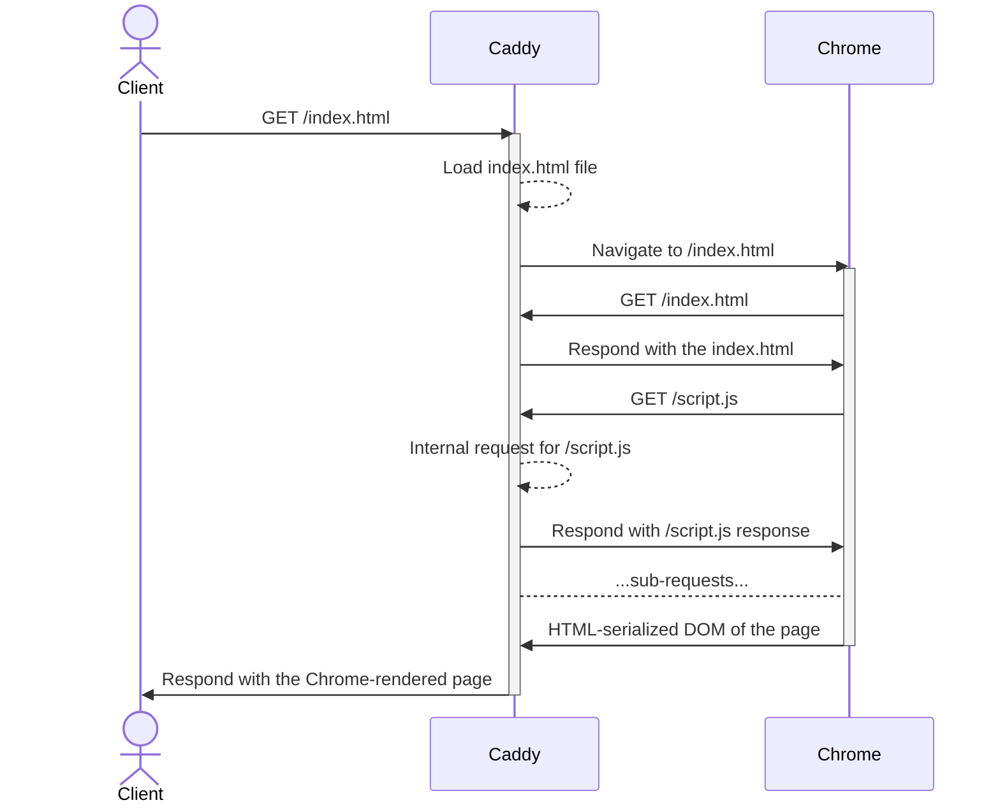

# Caddy Chrome

> Caddy middleware to server-side render Javascript applications using Chrome

The middleware takes an HTML response from the upstream handlers, loads it up in Chrome, and intercepts requests from the browser. Requests to the same host are routed internally in the webserver, possibly loading files, but also speaking to other applications e.g. by a reverse proxy. After the page is fully loaded, DOM is serialized to an HTML and the returned back to the client as the response.



## Asynchronous components

The middleware handles asynchronous components on the page using [`pending-task` protocol](https://github.com/webcomponents-cg/community-protocols/blob/main/proposals/pending-task.md). For an example, see [promise.html](testdata/promise.html).

## Configuration

```caddy
chrome {
    timeout 10s
    mime_types text/html
    
    exec /usr/bin/google-chrome --headless
    exec_no_default_flags /usr/bin/google-chrome --headless
    url http://localhost:9222/
    
    fullfill_hosts localhost app.example.com api.example.com
    continue_hosts cdn.example.com static.example.com
}
```

- `timeout` - maximum time to wait for Chrome to render the page, default is `10s`.
- `mime_types` - list of MIME types to render, default is `text/html`.
- Browser (only one of these):
  - `exec` - executes the local browser binary by given path, if the first argument starts with a dash (`-`), the binary is automatically found in the path and all the arguments are treated as additional flags on top of the [default flags](https://pkg.go.dev/github.com/chromedp/chromedp#pkg-variables)
  - `exec_no_default_flags` - the same as `exec` but without the default flags
  - `url` - URL to the debugging protocol endpoint of a remote browser instance
- `fullfill_hosts` - a list of hosts to issue as internal requests through the webserver, there's automatically the host of the original request
- `continue_hosts` - a list of hosts to let Chrome do the regular network requests

## Build

```shell
xcaddy build --with github.com/jakubkulhan/caddy-chrome
```

## License

Licensed under MIT license. See [LICENSE](LICENSE).
