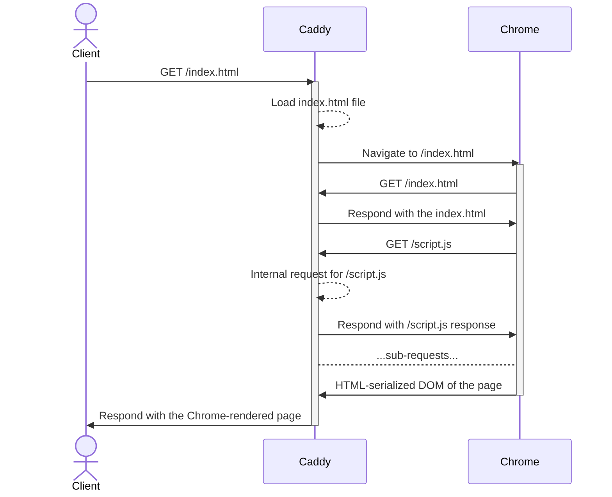

# Caddy Chrome

> Caddy middleware to server-side render Javascript applications using Chrome

## Server-side rendering

The middleware takes an HTML response from the upstream handlers, loads it up in a headless browser on the server, and intercepts requests from the browser. Interception is done by an in-process HTTP proxy: in `exec` mode the middleware launches the browser with `--proxy-server` (chrome) or `--http-proxy` (lightpanda) pointing at the proxy, MITMs HTTPS via a per-process self-signed CA, and routes requests according to host (same origin / `fulfill_hosts` → through the same Caddy server, `continue_hosts` → real network fetch, otherwise blocked). After the page is fully loaded, DOM is serialized to an HTML and then returned back to the client as the response.


```mermaid
sequenceDiagram
    actor Client
    participant Caddy
    participant Chrome
    Client->>Caddy: GET /index.html
    activate Caddy
    Caddy-->>Caddy: Load index.html file
    Caddy->>Chrome: Navigate to /index.html
    activate Chrome
    Chrome->>Caddy: GET /index.html
    Caddy->>Chrome: Respond with the index.html
    Chrome->>Caddy: GET /script.js
    Caddy-->>Caddy: Internal request for /script.js
    Caddy->>Chrome: Respond with /script.js response
    Caddy-->Chrome: ...sub-requests...
    Chrome->>Caddy: HTML-serialized DOM of the page
    deactivate Chrome
    Caddy->>Client: Respond with the Chrome-rendered page
    deactivate Caddy
```

## Asynchronous components

The middleware handles asynchronous components on the page using [`pending-task` protocol](https://github.com/webcomponents-cg/community-protocols/blob/main/proposals/pending-task.md). For an example, see [pending_task.html](testdata/pending_task.html).

## Resource hints

Because Chrome on the server loads up the page the same way as the browser on the client, we can know what resources the page needs. Therefore, to speed up loading on the client side, the middleware adds [preload](https://developer.mozilla.org/en-US/docs/Web/HTML/Attributes/rel/preload) and [preconnect](https://developer.mozilla.org/en-US/docs/Web/HTML/Attributes/rel/preconnect) resource hints as Link HTTP headers.

## Configuration

```caddy
chrome {
    timeout 10s
    mime_types text/html
    
    exec /usr/bin/google-chrome --headless
    exec_no_default_flags /usr/bin/google-chrome --headless
    url http://localhost:9222/
    
    fullfill_hosts localhost app.example.com api.example.com
    continue_hosts cdn.example.com static.example.com
}
```

- `timeout` - maximum time to wait for Chrome to render the page, default is `10s`.
- `mime_types` - list of MIME types to render, default is `text/html`.
- Browser (only one of these):
  - `exec` - the middleware launches a browser process itself and connects to it. If a path is given, that binary is used; otherwise PATH is searched: **lightpanda first, then chrome variants** (`google-chrome`, `google-chrome-stable`, `chromium`, `chromium-browser`, plus `/Applications/Google Chrome.app/...` and `/Applications/Chromium.app/...` on macOS). For chrome-kind binaries a sensible default flag set is applied; for lightpanda the middleware runs it as `lightpanda serve --host 127.0.0.1 --port <picked>`. Extra flags after `--` are appended to the launch command. The browser kind is inferred from the binary basename (anything containing "lightpanda" → lightpanda mode).
  - `exec_no_default_flags` - the same as `exec` but without the default chrome flags (no effect for lightpanda)
  - `url` - URL to the debugging protocol endpoint of a remote browser instance
- `fullfill_hosts` - a list of hosts to issue as internal requests through the webserver, there's automatically the host of the original request
- `continue_hosts` - a list of hosts to let Chrome do the regular network requests

Every render opens a fresh CDP WebSocket to the browser. For `exec` mode the middleware launches the browser once on a known port (managed via `os/exec`, not chromedp's allocator, so both chrome and lightpanda are supported) and connects to it per request; for `url` mode it opens a new WS per request to the configured remote endpoint. This avoids the per-request `Target.createBrowserContext` round-trips on a shared connection (faster on Chrome) and gives Lightpanda 0.2.4+ a separate browser per connection (true concurrency).

## Browsers

In addition to headless Chrome, [Lightpanda](https://lightpanda.io/) is supported as a CDP-compatible backend. The simplest setup is `exec` with no path — if `lightpanda` is in PATH it'll be picked over chrome and the middleware launches `lightpanda serve` itself. Alternatively, run it externally as `lightpanda serve --host 127.0.0.1 --port 9222` and point caddy-chrome at it via `url http://127.0.0.1:9222/`. Lightpanda is detected automatically (via `/json/version`) and the middleware switches to a single-target rendering mode:

- as for Chrome, every render opens a fresh CDP WebSocket — Lightpanda 0.2.4+ gives each connection its own full browser, so concurrent requests render in parallel;
- `Fetch` interception is skipped — Lightpanda's CDP processes commands serially per session, and dispatching `Fetch.fulfillRequest`/`continueRequest` for a sub-resource while the navigation fulfillment is being parsed deadlocks the WS read loop (see [lightpanda-io/browser#2391](https://github.com/lightpanda-io/browser/issues/2391)). Instead, in `exec` mode the middleware runs a small HTTP proxy and launches Lightpanda with `--http-proxy` pointing at it: the navigation is served directly from the buffered upstream response (no second upstream hit), same-origin sub-resources flow back through the same Caddy server's handler chain (with a marker header to short-circuit re-rendering), and HTTPS `CONNECT` is MITMed using a per-process self-signed CA so HTTPS sub-resources go through the same routing as plain HTTP. In `url` mode (external Lightpanda) we fall back to a `X-Caddy-Chrome-Bypass` header set via `Network.setExtraHTTPHeaders` so the middleware's `ServeHTTP` short-circuits when Lightpanda fetches the URL itself;
- if Lightpanda follows a cross-origin redirect, caddy-chrome detects it via `location.href` and falls back to the original upstream response;
- shadow roots are not exposed through Lightpanda's CDP `DOM.getDocument`, so a JS-side serializer walks the live DOM (including each `el.shadowRoot` and any unparsed `<template shadowrootmode>` elements) and returns the HTML directly, without mutating the document.

Lightpanda is a headless browser without a rendering pipeline, so it does not fetch stylesheets, images or fonts at all — those are not visible to the middleware and no preload `Link` headers are emitted for them. If your Caddy site serves HTTPS to localhost (e.g. for tests), pass `--insecure-disable-tls-host-verification` when starting `lightpanda serve`.

## Build

```shell
xcaddy build --with github.com/jakubkulhan/caddy-chrome
```

## License

Licensed under MIT license. See [LICENSE](LICENSE).
