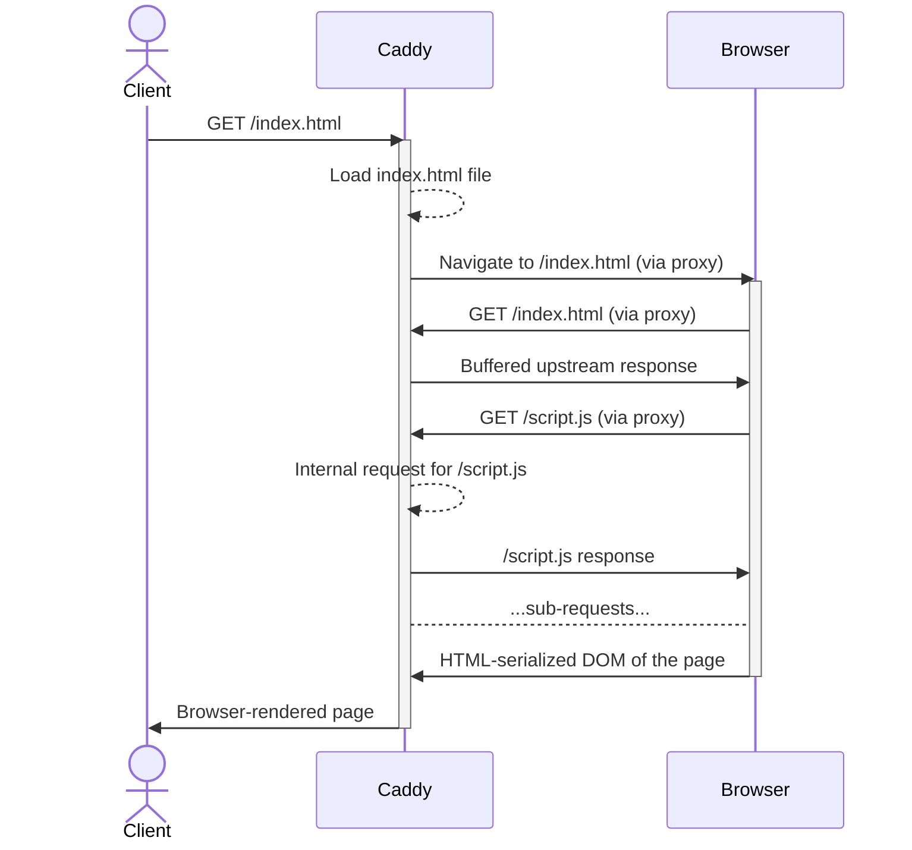

# Caddy Chrome

> Caddy middleware to server-side render JavaScript applications using a headless browser (Chrome or Lightpanda).

## Server-side rendering

The middleware takes an HTML response from the upstream handlers, loads it up in a headless browser on the server, and intercepts the browser's outgoing HTTP requests through an in-process proxy. Requests to the same Caddy server are routed internally (file_server, reverse_proxy, etc.) without a second network hop; cross-origin requests can be allowlisted. After the page is fully loaded, the DOM is serialized to HTML and returned to the client.


```mermaid
sequenceDiagram
    actor Client
    participant Caddy
    participant Browser
    Client->>Caddy: GET /index.html
    activate Caddy
    Caddy-->>Caddy: Load index.html file
    Caddy->>Browser: Navigate to /index.html (via proxy)
    activate Browser
    Browser->>Caddy: GET /index.html (via proxy)
    Caddy->>Browser: Buffered upstream response
    Browser->>Caddy: GET /script.js (via proxy)
    Caddy-->>Caddy: Internal request for /script.js
    Caddy->>Browser: /script.js response
    Caddy-->Browser: ...sub-requests...
    Browser->>Caddy: HTML-serialized DOM of the page
    deactivate Browser
    Caddy->>Client: Browser-rendered page
    deactivate Caddy
```

## Asynchronous components

The middleware handles asynchronous components on the page using [`pending-task` protocol](https://github.com/webcomponents-cg/community-protocols/blob/main/proposals/pending-task.md). For an example, see [pending_task.html](testdata/pending_task.html).

## Resource hints

Because the headless browser loads the page the same way as a real client, we know which resources the page needs. The middleware emits [preload](https://developer.mozilla.org/en-US/docs/Web/HTML/Attributes/rel/preload) and [preconnect](https://developer.mozilla.org/en-US/docs/Web/HTML/Attributes/rel/preconnect) `Link` HTTP headers so the client can fetch them in parallel. (Lightpanda has no rendering pipeline and never fetches stylesheets, images, or fonts, so no preload hints are emitted for those when running on Lightpanda.)

## Browsers

Both headless [Chrome](https://www.google.com/chrome/) and [Lightpanda](https://lightpanda.io/) — a CDP-compatible, headless-only browser written in Zig — are supported. With no path configured, `exec` searches PATH **lightpanda-first**, then chrome variants (`google-chrome`, `google-chrome-stable`, `chromium`, `chromium-browser`, plus `/Applications/Google Chrome.app/...` and `/Applications/Chromium.app/...` on macOS). The browser kind is inferred from the binary basename (anything containing `lightpanda` → lightpanda mode).

If your Caddy site serves HTTPS with a self-signed cert (e.g. for local development on Lightpanda), pass `--insecure-disable-tls-host-verification` as a flag in the `exec` directive.

## Configuration

```caddy
chrome {
    timeout 10s
    mime_types text/html

    exec /usr/bin/google-chrome
    # exec_no_default_flags /usr/bin/google-chrome
    # url http://localhost:9222/

    fulfill_hosts localhost app.example.com api.example.com
    continue_hosts cdn.example.com static.example.com
}
```

- `timeout` — maximum time to wait for the browser to render the page. Default `10s`.
- `mime_types` — list of upstream MIME types to render. Default `text/html`.
- Browser (only one of these):
  - `exec` — the middleware launches a browser process itself and connects to it. If a path is given, that binary is used; otherwise PATH is searched (lightpanda first, then chrome variants — see [Browsers](#browsers)). For chrome a sensible default flag set is applied; for lightpanda the middleware runs `lightpanda serve --host 127.0.0.1 --port <picked>`. Extra flags after `--` are appended to the launch command.
  - `exec_no_default_flags` — same as `exec` but without the chrome default flags (no effect for lightpanda).
  - `url` — URL to the debugging protocol endpoint of an already-running browser.
- `fulfill_hosts` — extra hosts to route through the Caddy server's handler chain (the original request's host is always included).
- `continue_hosts` — hosts the proxy is allowed to fetch from the real network. Anything not in `fulfill_hosts` or `continue_hosts` is blocked.

## Architecture

In `exec` mode the middleware starts a small HTTP proxy and launches the browser with `--proxy-server` (chrome) or `--http-proxy` (lightpanda) pointing at it. Per render, a `renderEntry` is registered with the proxy and the browser is told (via `Network.setExtraHTTPHeaders`) to tag every outgoing request with `X-Caddy-Chrome-Render: <id>`. The proxy uses that ID to:

- serve the navigation directly from the buffered upstream response — **no second upstream hit**;
- route same-origin and `fulfill_hosts` sub-resources back through `caddyhttp.Server.ServeHTTP` (a marker header short-circuits this middleware on the synthetic sub-request to avoid recursion);
- relay `continue_hosts` requests via `http.DefaultTransport`;
- block everything else;
- **MITM HTTPS** on `CONNECT`: a per-process self-signed CA mints leaf certs sharing one RSA key; chrome trusts that key's SPKI hash via `--ignore-certificate-errors-spki-list`; lightpanda accepts it via `--insecure-disable-tls-host-verification`. Decrypted requests go through the same routing as plain HTTP.

In `url` mode (browser launched externally), the proxy is replaced by a `X-Caddy-Chrome-Bypass` header. The middleware's `ServeHTTP` short-circuits when it sees that header so the browser fetches the navigation and sub-resources directly from the same Caddy server. This costs an extra upstream hit for the navigation.

Every render opens a fresh CDP WebSocket to the browser. Lightpanda 0.2.4+ gives each connection its own browser, so concurrent renders are truly parallel; on chrome the same code path avoids the per-request `Target.createBrowserContext` round-trips on a shared connection.

Lightpanda's CDP does not expose shadow roots through `DOM.getDocument`, so on lightpanda the DOM is serialized in JavaScript ([js/serialize_dom.js](js/serialize_dom.js)) — including `el.shadowRoot` and unparsed `<template shadowrootmode>` declarative-shadow-DOM templates — and returned via `Runtime.evaluate`. On chrome the existing CDP-driven serializer is used.

## Build

```shell
xcaddy build --with github.com/jakubkulhan/caddy-chrome
```

## Benchmarks

Apple M4 (2026), 3 × 10 iterations per page, lower is better. Each iteration is a full HTTP request through Caddy → browser → DOM serialized back. See [middleware_bench_test.go](middleware_bench_test.go).

| page                 | Lightpanda | Chrome  |
| ---                  | ---        | ---     |
| `static_html`        | 6.5 ms     | 124 ms  |
| `javascript_module`  | 6.8 ms     | 124 ms  |
| `shadow_dom`         | 6.6 ms     | 122 ms  |
| `fetch_get`          | 7.1 ms     | 124 ms  |
| `pending_task` (1 s) | 1008 ms    | 1117 ms |
| **parallel** `js_module` (`-cpu=10`) | 1.5 ms | 114 ms |

Reproduce:

```shell
# Lightpanda
CADDY_CHROME_TEST_EXEC_PATH=$(which lightpanda) CADDY_CHROME_TEST_BROWSER_LABEL=lightpanda \
  go test -bench='BenchmarkRender$|BenchmarkRenderParallel$' -benchtime=10x -run=^$ -count=3 .

# Chrome
CADDY_CHROME_TEST_EXEC_PATH=/path/to/google-chrome CADDY_CHROME_TEST_BROWSER_LABEL=chrome \
  go test -bench='BenchmarkRender$|BenchmarkRenderParallel$' -benchtime=10x -run=^$ -count=3 .
```

## License

Licensed under MIT license. See [LICENSE](LICENSE).
